# 献立ガチャサービス - アーキテクチャ図

本ドキュメントには、MGC-V1プロジェクトの各種アーキテクチャ図が含まれています。

## 目次

1. [システム全体アーキテクチャ](#システム全体アーキテクチャ)
2. [3アプリケーション構成](#3アプリケーション構成)
3. [購入者向けECサイト（consumer-site）構成](#購入者向けecサイトconsumer-site構成)
4. [管理者向け管理サイト構成](#管理者向け管理サイト構成)
5. [データフロー図](#データフロー図)
6. [認証・認可フロー](#認証認可フロー)
7. [決済フロー（Stripe）](#決済フローstripe)

---

## システム全体アーキテクチャ

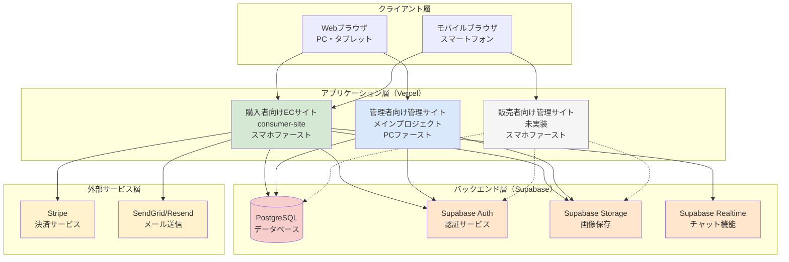

---

## 3アプリケーション構成

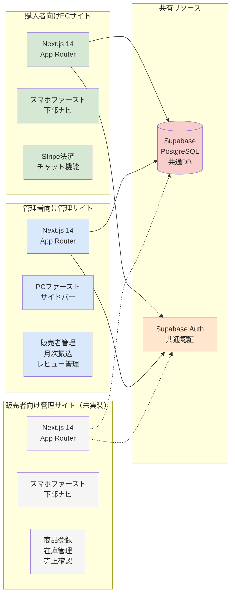

**重要ポイント**:
- すべてのアプリケーションが**同一のSupabaseプロジェクト**を共有
- RLS（Row Level Security）でデータアクセスを制御
- 各アプリは独立してデプロイ可能

---

## 購入者向けECサイト（consumer-site）構成

### ディレクトリ構造

```mermaid
graph TB
    ROOT[consumer-site/]

    subgraph "アプリケーション層"
        APP[app/]
        AUTH[app/auth/<br/>認証ページ]
        API[app/api/<br/>APIルート]
        PAGES[ページコンポーネント]
    end

    subgraph "API Routes"
        API_PROD[api/products/]
        API_ORDER[api/orders/]
        API_REVIEW[api/reviews/]
        API_CHAT[api/chat/]
        API_STRIPE[api/stripe/<br/>checkout/<br/>webhook/]
    end

    subgraph "主要ページ"
        HOME[/ トップページ<br/>商品一覧]
        PRODUCT[/product/[id]/<br/>商品詳細]
        CART[/cart/<br/>カート]
        CHECKOUT[/checkout/<br/>決済]
        ORDERS[/orders/<br/>注文履歴]
        CHAT[/chat/<br/>チャット]
        PROFILE[/profile/<br/>プロフィール]
        SEARCH[/search/<br/>検索]
        VEGGIES[/vegetables/[name]/farmers/<br/>野菜別農家一覧]
    end

    subgraph "コンポーネント層"
        COMP[components/]
        NAV[navigation/<br/>bottom-nav<br/>header]
    end

    subgraph "ライブラリ層"
        LIB[lib/]
        AUTH_HELPER[auth-helpers.ts<br/>認証ヘルパー]
        STRIPE_LIB[stripe.ts<br/>Stripe連携]
        SUPABASE[supabase/<br/>client.ts<br/>server.ts<br/>middleware.ts]
    end

    subgraph "型定義"
        TYPES[types/<br/>database.ts<br/>仕様書ベースの型定義]
    end

    ROOT --> APP
    ROOT --> COMP
    ROOT --> LIB
    ROOT --> TYPES

    APP --> AUTH
    APP --> API
    APP --> PAGES

    API --> API_PROD
    API --> API_ORDER
    API --> API_REVIEW
    API --> API_CHAT
    API --> API_STRIPE

    PAGES --> HOME
    PAGES --> PRODUCT
    PAGES --> CART
    PAGES --> CHECKOUT
    PAGES --> ORDERS
    PAGES --> CHAT
    PAGES --> PROFILE
    PAGES --> SEARCH
    PAGES --> VEGGIES

    COMP --> NAV

    LIB --> AUTH_HELPER
    LIB --> STRIPE_LIB
    LIB --> SUPABASE

    style ROOT fill:#d5e8d4
    style APP fill:#dae8fc
    style API fill:#fff2cc
    style PAGES fill:#e1d5e7
    style COMP fill:#ffe6cc
    style LIB fill:#f8cecc
    style TYPES fill:#f5f5f5
```

### 主要機能フロー

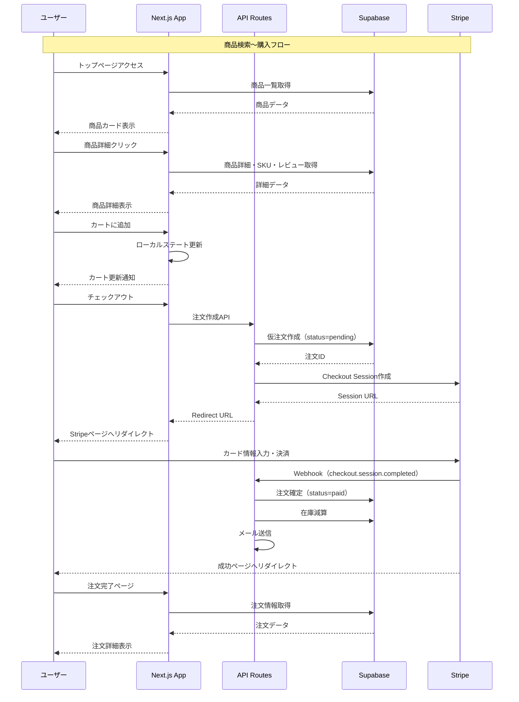

### 下部ナビゲーション（スマホファースト）

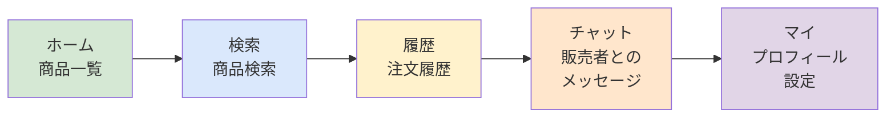

---

## 管理者向け管理サイト構成

### ディレクトリ構造

```mermaid
graph TB
    ROOT[mgc-v1/<br/>メインプロジェクト]

    subgraph "アプリケーション層"
        APP[app/]
        COMP[app/components/ui/<br/>共通UIコンポーネント]
        PAGES[ページ]
    end

    subgraph "主要UIコンポーネント"
        ALERT[AlertProvider<br/>NexusAlert<br/>NexusAlertBox]
        BUTTON[NexusButton]
        INPUT[NexusInput<br/>NexusTextarea<br/>NexusSelect<br/>NexusCheckbox<br/>NexusRadio]
        CARD[NexusCard<br/>ContentCard]
        TABLE[HoloTable<br/>Pagination]
        MODAL[BaseModal<br/>ConfirmationModal<br/>ModalContext]
        OTHER[StatusIndicator<br/>WorkflowProgress<br/>CertBadge<br/>TrackingNumberDisplay]
    end

    subgraph "ページ"
        HOME_PAGE[/ ダッシュボード]
        PRIVACY[/privacy-policy/]
        TERMS[/terms/]
    end

    subgraph "ライブラリ層"
        LIB[lib/]
        HOOKS[hooks/useApi.ts]
        UTILS[utils.ts<br/>image-processor.ts]
    end

    ROOT --> APP
    ROOT --> LIB

    APP --> COMP
    APP --> PAGES

    COMP --> ALERT
    COMP --> BUTTON
    COMP --> INPUT
    COMP --> CARD
    COMP --> TABLE
    COMP --> MODAL
    COMP --> OTHER

    PAGES --> HOME_PAGE
    PAGES --> PRIVACY
    PAGES --> TERMS

    LIB --> HOOKS
    LIB --> UTILS

    style ROOT fill:#dae8fc
    style APP fill:#e1d5e7
    style COMP fill:#fff2cc
    style PAGES fill:#d5e8d4
    style LIB fill:#f8cecc
```

### 想定される管理機能（未実装）

```mermaid
graph TB
    DASHBOARD[ダッシュボード<br/>KPI表示]

    subgraph "販売者管理"
        FARMERS_LIST[販売者一覧]
        FARMERS_NEW[新規販売者登録]
        FARMERS_DETAIL[販売者詳細]
        FARMERS_TOGGLE[有効化・無効化]
    end

    subgraph "注文管理"
        ORDERS_LIST[注文一覧]
        ORDERS_SEARCH[期間・販売者検索]
        ORDERS_STATS[集計]
    end

    subgraph "振込管理"
        PAYOUTS_DASH[振込ダッシュボード]
        PAYOUTS_LIST[振込一覧]
        PAYOUTS_PROCESS[月次集計・振込処理]
        PAYOUTS_DETAIL[振込詳細]
    end

    subgraph "レビュー管理"
        REVIEWS_LIST[レビュー一覧]
        REVIEWS_DETAIL[レビュー詳細]
        REVIEWS_HIDE[非表示化]
    end

    subgraph "お知らせ管理"
        ANNOUNCEMENTS_LIST[お知らせ一覧]
        ANNOUNCEMENTS_NEW[新規作成]
        ANNOUNCEMENTS_EDIT[編集]
    end

    subgraph "システム設定"
        SETTINGS_SYSTEM[システム設定<br/>手数料率・送料]
        SETTINGS_ADMIN[管理者一覧]
    end

    DASHBOARD --> FARMERS_LIST
    DASHBOARD --> ORDERS_LIST
    DASHBOARD --> PAYOUTS_DASH
    DASHBOARD --> REVIEWS_LIST
    DASHBOARD --> ANNOUNCEMENTS_LIST
    DASHBOARD --> SETTINGS_SYSTEM

    style DASHBOARD fill:#d5e8d4
    style FARMERS_LIST fill:#dae8fc
    style ORDERS_LIST fill:#fff2cc
    style PAYOUTS_DASH fill:#ffe6cc
    style REVIEWS_LIST fill:#e1d5e7
    style ANNOUNCEMENTS_LIST fill:#f8cecc
    style SETTINGS_SYSTEM fill:#f5f5f5
```

### PCファーストレイアウト

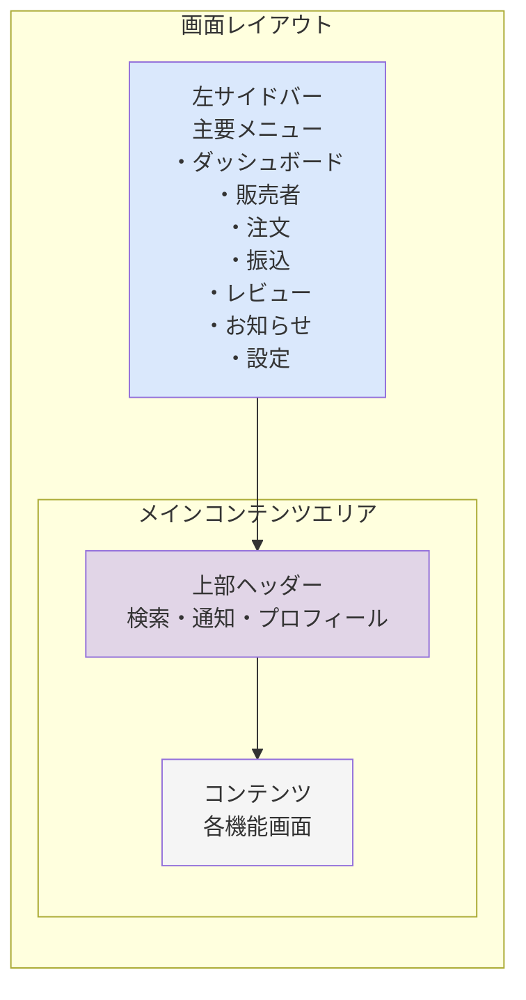

---

## データフロー図

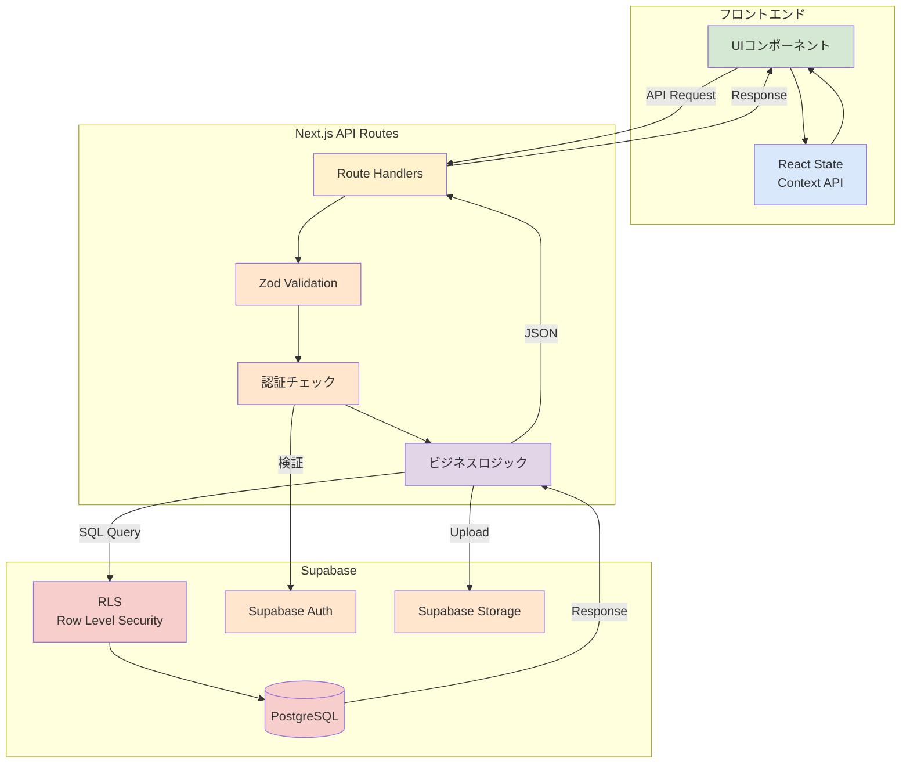

---

## 認証・認可フロー

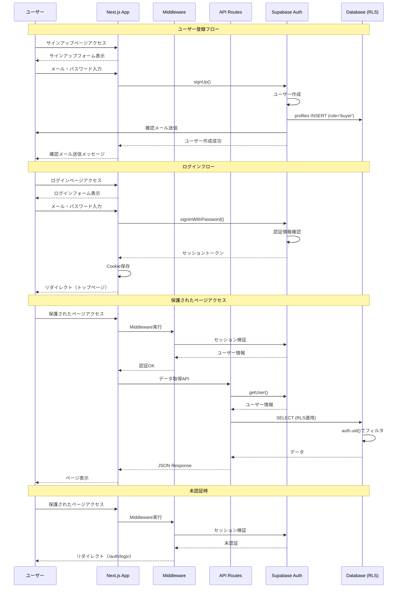

### RLSポリシー例

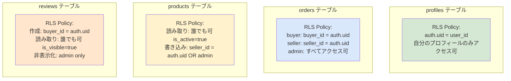

---

## 決済フロー（Stripe）

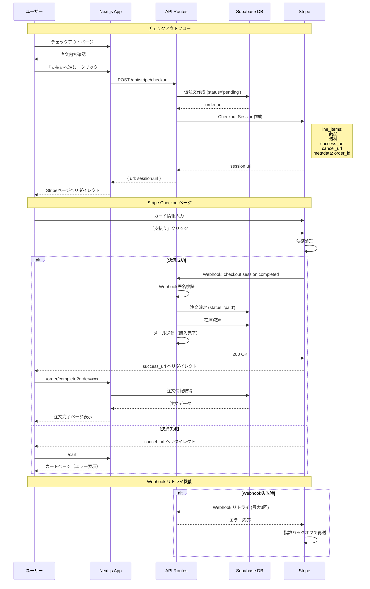

### Stripe Webhook処理詳細

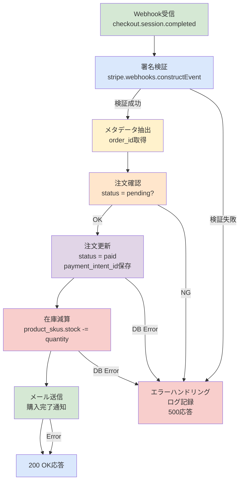

---

## チャット機能（Supabase Realtime）

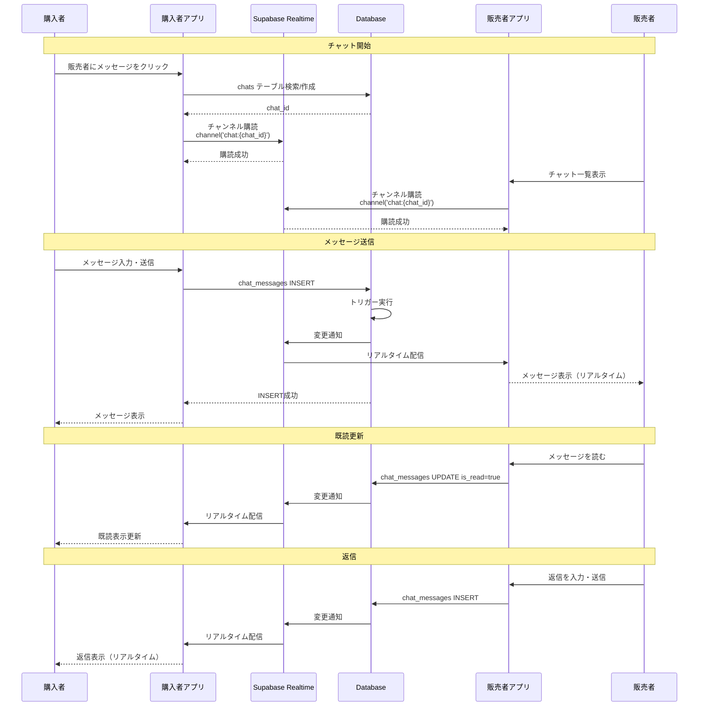

---

## まとめ

### 技術スタック概要

| レイヤー | 技術 | 用途 |
|---------|------|------|
| **フロントエンド** | Next.js 14 (App Router) | サーバーサイドレンダリング・ルーティング |
| | React 18 | UIコンポーネント |
| | TypeScript | 型安全性 |
| | Tailwind CSS | スタイリング |
| **バックエンド** | Next.js API Routes | RESTful API |
| | Zod | バリデーション |
| **データベース** | Supabase (PostgreSQL) | データ永続化 |
| | Supabase Auth | 認証・認可 |
| | Supabase Storage | 画像保存 |
| | Supabase Realtime | チャット機能 |
| **決済** | Stripe Checkout | 決済処理 |
| | Stripe Webhooks | 決済確認 |
| **メール** | SendGrid / Resend | メール送信 |
| **デプロイ** | Vercel | ホスティング |
| **テスト** | Playwright | E2Eテスト |
| | Jest | ユニットテスト |

### 開発ステータス

| アプリケーション | ステータス | 説明 |
|----------------|-----------|------|
| 購入者向けECサイト | ✅ 実装済み | consumer-site/ |
| 管理者向け管理サイト | 🔄 一部実装 | UIコンポーネントのみ |
| 販売者向け管理サイト | ❌ 未実装 | 今後の開発予定 |

### 次のステップ

1. **管理者向け管理サイトの完成**
   - 販売者管理機能
   - 注文管理機能
   - 振込管理機能
   - レビュー管理機能
   - お知らせ管理機能

2. **販売者向け管理サイトの実装**
   - 商品登録・編集
   - 在庫管理
   - 注文確認
   - 売上確認
   - チャット対応

3. **機能拡張**
   - ガチャUI（Framer Motion）
   - お気に入り機能
   - クーポン・ポイントシステム
   - 定期購入
   - プッシュ通知

---

**作成日**: 2025-10-13
**バージョン**: 1.0
**更新履歴**: 初版作成
