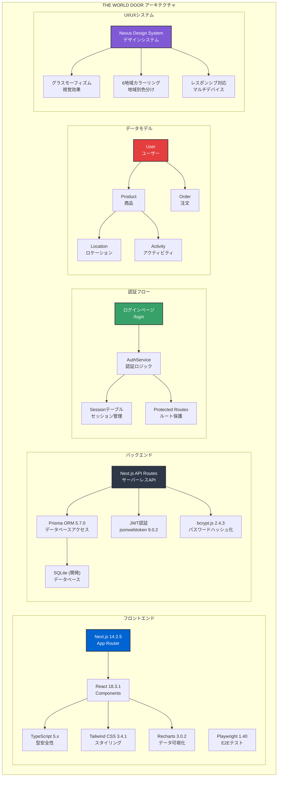
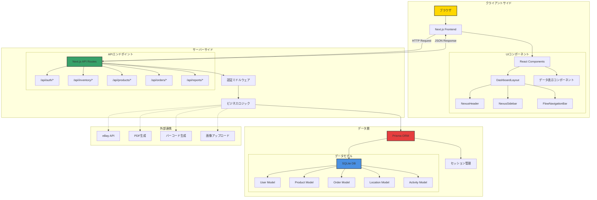
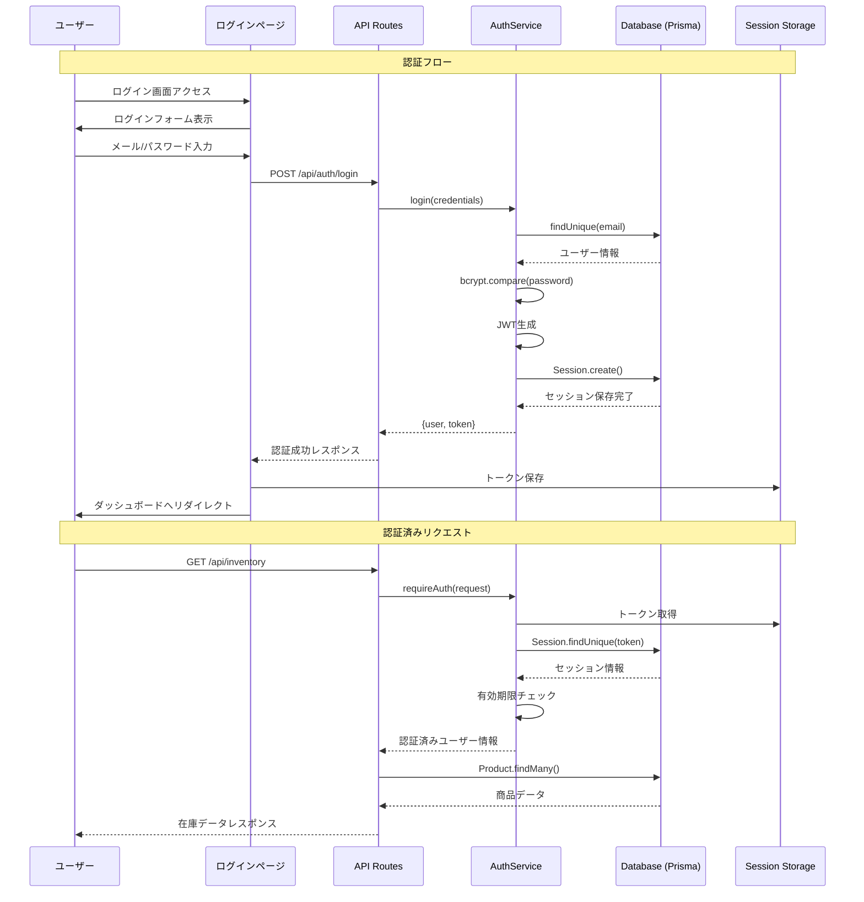
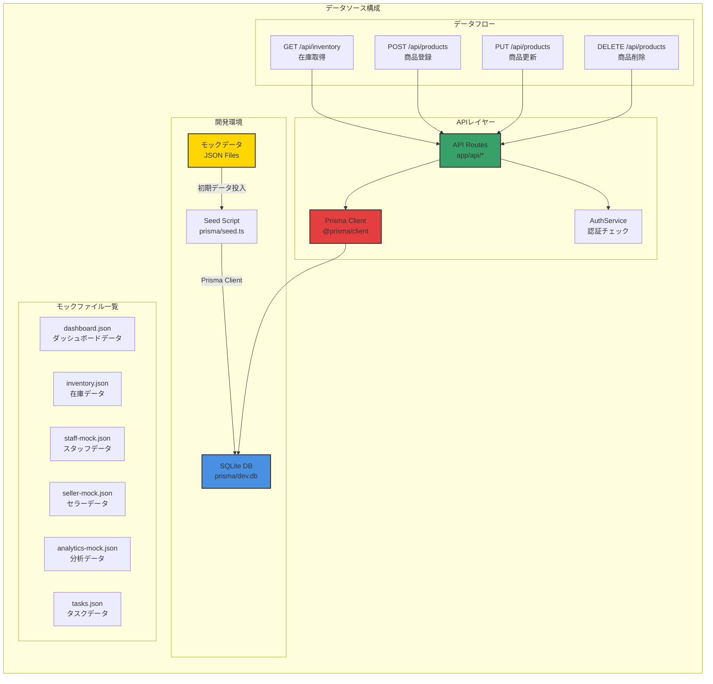
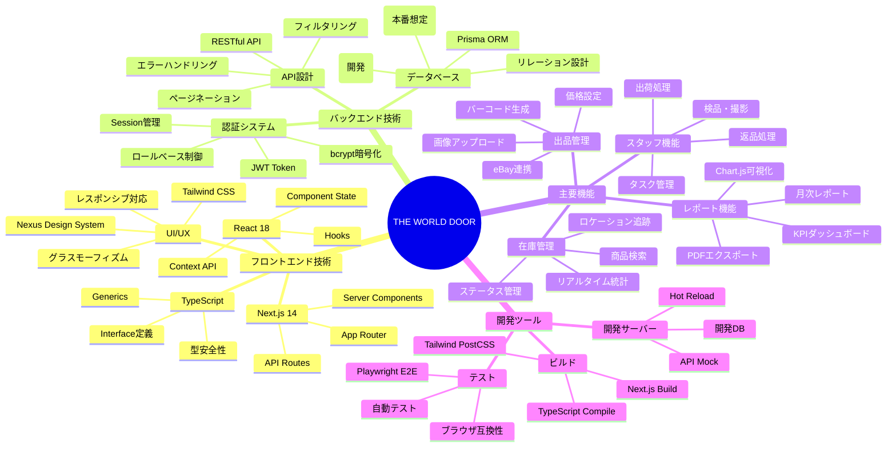

# 🏗️ THE WORLD DOOR 技術構成図解

## 📅 作成日: 2024年

## 📊 目次
1. [技術スタック概要](#技術スタック概要)
2. [システムアーキテクチャ](#システムアーキテクチャ)
3. [認証システムの仕組み](#認証システムの仕組み)
4. [データ管理構成](#データ管理構成)
5. [UI/UXアーキテクチャ](#uiuxアーキテクチャ)
6. [主要機能と技術の対応](#主要機能と技術の対応)
7. [開発・デプロイ構成](#開発デプロイ構成)
8. [モックデータ構成](#モックデータ構成)

---

## 技術スタック概要

### フロントエンド技術
- **Next.js 14.2.5** - React フルスタックフレームワーク
  - App Router 採用
  - Server Components 対応
  - API Routes でバックエンド統合
  
- **React 18.3.1** - UIライブラリ
  - Hooks による状態管理
  - コンポーネントベース設計
  
- **TypeScript 5.x** - 型安全な開発
  - 厳密な型定義
  - Interface による契約定義
  
- **Tailwind CSS 3.4.1** - ユーティリティファーストCSS
  - Nexus Design System 実装
  - グラスモーフィズム効果
  - 6地域カラーリング

### バックエンド技術
- **Prisma ORM 5.7.0** - モダンなデータベースツールキット
  - 型安全なクエリ
  - マイグレーション管理
  - SQLite（開発）/ PostgreSQL（本番想定）
  
- **JWT認証** - セキュアな認証システム
  - jsonwebtoken 9.0.2
  - bcrypt.js 2.4.3 でパスワードハッシュ化
  - Sessionテーブルでトークン管理

### 主要な依存関係
```json
{
  "dependencies": {
    "@prisma/client": "^5.7.0",
    "bcryptjs": "^2.4.3",
    "jsonwebtoken": "^9.0.2",
    "next": "14.2.5",
    "react": "^18.3.1",
    "recharts": "^3.0.2",
    "tailwindcss": "^3.4.1",
    "typescript": "^5"
  }
}
```

---

## システムアーキテクチャ

### 全体構成図


### レイヤー構成図


---

## 認証システムの仕組み

### 認証フロー図


### 認証実装の詳細
```typescript
// 認証フロー
1. ユーザーがログイン情報を送信
2. AuthService.login() でクレデンシャル検証
3. bcryptでパスワード照合
4. JWT トークン生成
5. Sessionテーブルに保存
6. クライアントにトークン返却
7. 以降のリクエストでトークン検証
```

### ロールベースアクセス制御
- **seller**: セラー向け機能へのアクセス
- **staff**: スタッフ向け機能へのアクセス
- **admin**: 管理者機能へのアクセス

---

## データ管理構成

### データフロー図


### 主要データモデル
- **User** - ユーザー管理（seller/staff/admin）
- **Product** - 商品情報
- **Order** - 注文管理
- **Location** - ロケーション管理
- **Activity** - アクティビティログ
- **Session** - セッション管理
- **InventoryMovement** - 在庫移動履歴

---

## UI/UXアーキテクチャ

### コンポーネント階層
```
DashboardLayout（メインレイアウト）
├── NexusHeader（ヘッダー）
├── NexusSidebar（サイドバー）
├── FlowNavigationBar（フロー表示）
└── ページコンテンツ
    ├── データ表示コンポーネント
    ├── フォームコンポーネント
    └── 機能別コンポーネント
```

### Nexus Design System
- **グラスモーフィズム効果**: 半透明のぼかし効果
- **6地域カラーリング**: 地域別の色分け
- **レスポンシブ対応**: モバイル・タブレット・デスクトップ
- **アクセシビリティ**: WCAG準拠

---

## 主要機能と技術の対応

| 機能 | 使用技術 | 実装ファイル |
|------|----------|------------|
| リアルタイム在庫統計 | React Hooks + API Polling | `/api/inventory/stats/route.ts` |
| バーコード生成 | Canvas API + PDF生成 | `/api/products/barcode/route.ts` |
| 画像アップロード | File API + Base64エンコード | `/components/features/ImageUploader.tsx` |
| データ可視化 | Recharts (Chart.js風) | `/components/features/kpi/AdvancedKPIDashboard.tsx` |
| E2Eテスト | Playwright 1.40 | `/tests/*.spec.ts` |
| 商品タイムライン | vis.js概念実装 | `/components/features/ProductTimeline.tsx` |
| eBay連携 | API Routes + テンプレート | `/api/ebay/listing/route.ts` |

---

## 開発・デプロイ構成

### 開発環境コマンド
```bash
# 開発サーバー起動（ポート3001）
npm run dev

# Prisma Studio起動（DBビューアー）
npm run db:studio

# E2Eテスト実行
npm run test

# テストレポート表示
npm run test:report
```

### ビルド・デプロイコマンド
```bash
# 本番ビルド
npm run build

# 本番サーバー起動
npm run start

# Prismaマイグレーション
npm run db:migrate

# 初期データ投入
npm run db:seed
```

### 環境変数設定
```env
DATABASE_URL="file:./dev.db"  # 開発環境
JWT_SECRET="your-secret-key"
NEXT_PUBLIC_API_URL="http://localhost:3001"
```

---

## モックデータ構成

### モックデータファイル一覧

| ファイル名 | 用途 | 主なデータ |
|-----------|------|-----------|
| `dashboard.json` | ダッシュボード統計 | KPI、売上データ、在庫サマリー |
| `inventory.json` | 在庫データ | 商品リスト、在庫状態、価格情報 |
| `staff-mock.json` | スタッフ向けデータ | タスク、業務統計、パフォーマンス |
| `seller-mock.json` | セラー向けデータ | 出品情報、売上履歴、顧客データ |
| `analytics-mock.json` | 分析データ | グラフ用データ、トレンド、予測 |
| `tasks.json` | タスクデータ | 優先度、期限、担当者情報 |

### データフロー
1. **開発時**: モックデータ（JSON）→ Prisma Seed → SQLite DB
2. **本番時**: PostgreSQL → Prisma Client → API Routes → フロントエンド

---

## 技術マインドマップ



---

## まとめ

THE WORLD DOORは、最新のWeb技術スタックを活用した、スケーラブルで保守性の高いフルスタックアプリケーションです。

### 技術的特徴
- **型安全性**: TypeScript + Prismaによる完全な型安全性
- **パフォーマンス**: Next.js App Routerによる最適化
- **セキュリティ**: JWT認証とロールベースアクセス制御
- **開発効率**: モックデータとE2Eテストによる品質保証
- **拡張性**: モジュラーなコンポーネント設計

### 今後の拡張予定
- WebSocket によるリアルタイム通信
- GraphQL API の導入
- マイクロサービス化
- CI/CD パイプラインの構築
- 多言語対応（i18n） 