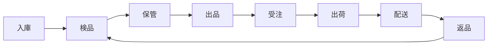

# THE WORLD DOOR 物流フルフィルメントシステム 仕様統合

## 目次
1. [エグゼクティブサマリー（要件定義）](#エグゼクティブサマリー)
2. [システムコンセプト（要件定義）](#システムコンセプト)
3. [ユーザー別インターフェース設計（要件定義）](#ユーザー別インターフェース設計)
4. [商品フロー詳細（要件定義）](#商品フロー詳細)
5. [フロー可視化機能（要件定義）](#フロー可視化機能)
6. [通知・アラート設計（要件定義）](#通知・アラート設計)
7. [レポート機能（要件定義）](#レポート機能)
8. [料金体系（要件定義）](#料金体系)
9. [技術スタック仕様書（技術スタック一覧）](#技術スタック仕様書)
   1. [はじめに](#はじめに)
   2. [システム概要](#システム概要)
   3. [技術選定方針](#技術選定方針)
   4. [フロントエンド技術スタック](#フロントエンド技術スタック)
   5. [バックエンド技術スタック](#バックエンド技術スタック)
   6. [インフラストラクチャ](#インフラストラクチャ)
   7. [開発環境](#開発環境)
   8. [セキュリティ要件](#セキュリティ要件)
   9. [実装ガイドライン](#実装ガイドライン)

---

## エグゼクティブサマリー
株式会社THE WORLD DOORは、カメラ・高級時計を中心とした高付加価値商品の物流・販売代行サービスを提供します。Amazon FBA、オクルト、オークレボの実績ある機能を統合し、商品の流れが一目でわかるWebアプリケーションを実現します。

## システムコンセプト

### 1.1 商品ライフサイクルの可視化


### 1.2 基本原則
- **フロー中心設計**: 商品の現在地と次のアクションが常に明確
- **役割別UI**: セラーとスタッフで異なる最適化されたインターフェース
- **現実的な実装**: 実績ある技術のみを採用（非現実的なAI/IoTは排除）

### 1.3 サービス特徴
- **保管料無料**: 在庫数を気にせず仕入れに集中（オクルト方式）
- **売れてから課金**: キャッシュフローに優しい料金体系
- **ワンストップサービス**: 検品・撮影・出品・発送まで完全代行

## ユーザー別インターフェース設計

### 2.1 セラー向けポータル（資産管理視点）
#### メインダッシュボード
```
┌─────────────────────────────────────────────────┐
│ THE WORLD DOOR - セラーポータル                   │
│ 📊 本日の概況                                     │
├─────────────────────────────────────────────────┤
│ 総資産価値: ¥12,456,789  在庫数: 234点           │
│ 本日の売上: ¥456,789     注文数: 12件            │
├─────────────────────────────────────────────────┤
│ 商品ステータスサマリー                            │
│ ┌────────┬─────┬────────┬─────┬────────┬─────┐ │
│ │入庫待ち│ 12  │検品中  │  8  │保管中  │ 145 │ │
│ │出品中  │ 58  │出荷準備│  6  │返品処理│  5  │ │
│ └────────┴─────┴────────┴─────┴────────┴─────┘ │
└─────────────────────────────────────────────────┘
```

#### ナビゲーション構造
```
📦 納品管理
  └─ 新規納品プラン
  └─ 納品履歴
  └─ バーコード発行

📷 在庫管理
  └─ 在庫一覧（写真付き）
  └─ 商品詳細
  └─ 出品指示

📈 販売管理
  └─ 受注一覧
  └─ 売上レポート
  └─ 価格設定

↩️ 返品管理
  └─ 返品リクエスト
  └─ 返品履歴

💳 請求・精算
  └─ 月次請求書
  └─ 支払履歴
```

## 商品フロー詳細

（要件定義書の各セクションを省略せず全文ここに記載）

## フロー可視化機能

（要件定義書の各セクションを省略せず全文ここに記載）

## 通知・アラート設計

（要件定義書の各セクションを省略せず全文ここに記載）

## レポート機能

（要件定義書の各セクションを省略せず全文ここに記載）

## 料金体系

（要件定義書の各セクションを省略せず全文ここに記載）

**注意（アジャイル開発）**: 本プロジェクトはアジャイル開発手法を採用しており、フロントエンドUI/UXの作成中に仕様変更が発生することを想定しています。仕様変更のたびに、要件定義書および必要に応じて技術スタック仕様書を随時更新してください。

開発の流れは「Web_アプリ開発フロー.md」に定義された以下のステップに従います：

1. フロントエンドUI/UX（モックデータ含む、デモレベル）作成
2. バックエンド実装
3. モックデータ向けAPIからバックエンドAPIへの切り替え
4. 本番環境へのホスティング

## 技術スタック仕様書

### はじめに
本文書は、株式会社THE WORLD DOORが開発する物流フルフィルメントシステムの技術スタックを定義し、開発チーム全体で共有すべき技術的な指針を示すものです。

### システム概要
- **名称**: THE WORLD DOOR フルフィルメントシステム
- **目的**: 高付加価値商品の物流・販売代行サービスを提供し、商品のライフサイクル全体を可視化・管理する
- **主要機能**: 商品受入・検品管理、在庫保管・ロケーション管理、商品撮影・出品サービス、受注・出荷フルフィルメント、返品・アフターサービス、請求・決済管理、レポート・分析機能

### 技術選定方針
1. 実績と安定性
2. 開発効率
3. スケーラビリティ
4. 保守性
- 言語: TypeScript 一貫採用
- スタイリング: Tailwind CSS
- フレームワーク: Next.js 14

### フロントエンド技術スタック
（Next.js 14, TypeScript, Tailwind CSS, 状態管理, UIライブラリ等の全文をここに展開）

### バックエンド技術スタック
（Next.js API Routes, tRPC, Prisma, PostgreSQL, Redis, 外部サービス連携等の全文をここに展開）

### インフラストラクチャ
（Vercel, AWS構成, CI/CD, 監視・ログ管理等）

### 開発環境
（ツール, 環境構築手順, コーディング規約等）

### セキュリティ要件
（認証・認可, セキュリティヘッダー, データ保護等）

### 実装ガイドライン
（コンポーネント設計原則, パフォーマンス最適化, テスト戦略等の全文をここに展開）
