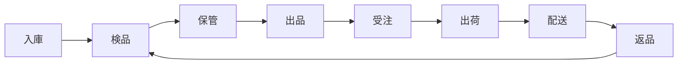

# THE WORLD DOOR 物流フルフィルメントシステム仕様書 v7.0（実装反映版）

**最終更新日**: 2025年1月13日

## エグゼクティブサマリー

株式会社THE WORLD DOORは、カメラ・高級時計を中心とした高付加価値商品の物流・販売代行サービスを提供します。Amazon FBA、オクルト、オークレボの実績ある機能を統合し、商品の流れが一目でわかるWebアプリケーションを実現します。

## 1. システムコンセプト

### 1.1 商品ライフサイクルの可視化


### 1.2 基本原則
- **フロー中心設計**: 商品の現在地と次のアクションが常に明確
- **役割別UI**: セラーとスタッフで異なる最適化されたインターフェース
- **現実的な実装**: 実績ある技術のみを採用（非現実的なAI/IoTは排除）

### 1.3 サービス特徴
- **保管料無料**: 在庫数を気にせず仕入れに集中（オクルト方式）
- **売れてから課金**: キャッシュフローに優しい料金体系
- **ワンストップサービス**: 検品・撮影・出品・発送まで完全代行

---

## 2. ユーザー別インターフェース設計

### 2.1 セラー向けポータル（資産管理視点）

#### メインダッシュボード
```
┌─────────────────────────────────────────────────┐
│ THE WORLD DOOR - セラーポータル                   │
│ ━━━━━━━━━━━━━━━━━━━━━━━━━━━━━━━━━━━━━━━━━━━━ │
│ 📊 本日の概況                                     │
├─────────────────────────────────────────────────┤
│ 総資産価値: ¥12,456,789  在庫数: 234点           │
│ 本日の売上: ¥456,789     注文数: 12件            │
├─────────────────────────────────────────────────┤
│ 商品ステータスサマリー                            │
│ ┌────────┬─────┬────────┬─────┬────────┬─────┐ │
│ │入庫待ち│ 12  │検品中  │  8  │保管中  │ 145 │ │
│ │出品中  │ 58  │出荷準備│  6  │返品処理│  5  │ │
│ └────────┴─────┴────────┴─────┴────────┴─────┘ │
└─────────────────────────────────────────────────┘
```

#### ナビゲーション構造
```
📦 納品管理
  └─ 新規納品プラン
  └─ 納品履歴
  └─ バーコード発行

📷 在庫管理
  └─ 在庫一覧（写真付き）
  └─ 商品詳細
  └─ 出品指示

📈 販売管理
  └─ 受注一覧
  └─ 売上レポート
  └─ 価格設定

↩️ 返品管理
  └─ 返品リクエスト
  └─ 返品履歴

💳 請求・精算
  └─ 月次請求書
  └─ 支払履歴
```

### 2.2 スタッフ向けポータル（タスク駆動型）

#### タスク中心のダッシュボード
```
┌─────────────────────────────────────────────────┐
│ THE WORLD DOOR - 業務管理システム                 │
│ ━━━━━━━━━━━━━━━━━━━━━━━━━━━━━━━━━━━━━━━━━━━━ │
│ 本日のタスク一覧                                  │
├─────────────────────────────────────────────────┤
│ 🔴 緊急タスク（2件）                              │
│   - 高額商品検品（Rolex GMT）                    │
│   - 返品再検品（Canon R5）                       │
├─────────────────────────────────────────────────┤
│ 🟡 通常タスク（15件）                             │
│   - 入庫検品: 8件                                │
│   - 商品撮影: 4件                                │
│   - 出荷準備: 3件                                │
└─────────────────────────────────────────────────┘
```

---

## 3. 商品フロー詳細（実装可能な機能のみ）

### 3.1 入庫プロセス

#### 納品プラン作成画面
```
必須入力項目:
┌─────────────────────────────────────────┐
│ 商品情報登録                             │
├─────────────────────────────────────────┤
│ SKU: [自動採番/手動入力]                 │
│ ブランド: [___________] ※オートコンプリート│
│ モデル/型番: [___________]               │
│ シリアル番号: [___________]              │
│ カテゴリー: ○カメラ本体 ○レンズ ○時計     │
│ 保険申告価値: ¥[___________]             │
│                                         │
│ 付属品（チェックボックス）:               │
│ □元箱 □保証書 □説明書 □充電器           │
│ □レンズキャップ □ストラップ             │
└─────────────────────────────────────────┘
```

#### バーコード発行
- 納品プラン確定後、商品別バーコードをPDF出力
- A4サイズに6枚配置（切り取り線付き）

### 3.2 検品プロセス

#### 検品チェックリスト画面（タブレット最適化）
```
商品ID: TWD-20250621-00001
━━━━━━━━━━━━━━━━━━━━━━━━━━━━━━━
【カメラ検品項目】
□ 外観
  └ キズ: [なし/小/中/大]
  └ へこみ: [なし/あり]
  └ ラバー劣化: [なし/あり]
□ 動作
  └ 電源: [OK/NG]
  └ シャッター: [OK/NG]
  └ AF動作: [OK/NG]
□ 光学系
  └ ファインダー: [クリア/曇り/カビ]
  └ センサー: [清浄/ゴミあり]
□ 付属品確認
  └ 申告内容と一致: [はい/いいえ]

[写真撮影] 最低6枚アップロード必須
[検品完了] → 次の商品へ
```

### 3.3 保管プロセス

#### ロケーション登録
```
バーコードスキャン順序:
1. 商品バーコード: [||||||||||||]
2. 棚番バーコード: [||||||||||||]
   → 自動登録完了

保管エリア:
- 標準棚: A-01～A-99
- 防湿庫: H-01～H-20（カメラ・レンズ）
- 金庫室: V-01～V-10（高級時計）
```

### 3.4 出品プロセス

#### 出品設定画面
```
┌─────────────────────────────────────────┐
│ eBay出品設定                             │
├─────────────────────────────────────────┤
│ テンプレート選択: [カメラ標準▼]          │
│ タイトル: Canon EOS R5 ボディ 美品       │
│ 開始価格: $[_____] 即決価格: $[_____]   │
│ 出品期間: ○3日 ○7日 ●10日              │
│                                         │
│ 商品説明（自動生成）:                    │
│ ┌─────────────────────────────────┐   │
│ │ブランド: Canon                    │   │
│ │モデル: EOS R5                     │   │
│ │コンディション: Aランク（美品）      │   │
│ │付属品: 元箱、保証書、充電器        │   │
│ │検品済み・動作確認済み              │   │
│ └─────────────────────────────────┘   │
│                                         │
│ [プレビュー] [出品承認]                  │
└─────────────────────────────────────────┘
```

### 3.5 受注・出荷プロセス

#### ピッキングリスト（スマートフォン表示）
```
本日の出荷リスト（優先度順）
━━━━━━━━━━━━━━━━━━━━━━━━
🔴 注文#12345（高額・急ぎ）
  商品: Rolex GMT Master II
  場所: V-03（金庫室）
  [ピッキング開始]

🟡 注文#12346（通常）
  商品: Canon 24-70mm F2.8
  場所: H-15（防湿庫）
  [ピッキング開始]
```

#### 梱包指示画面
```
商品別梱包仕様:
┌─────────────────────────────┐
│ Canon EOS R5                │
├─────────────────────────────┤
│ 1. エアキャップで包装        │
│ 2. 静電気防止袋に入れる      │
│ 3. 緩衝材を周囲に配置        │
│ 4. 新品段ボール（Mサイズ）    │
│ 5. 取扱注意シール貼付        │
└─────────────────────────────┘
```

### 3.6 返品プロセス

#### 返品再検品画面
```
返品商品比較画面:
┌────────────┬────────────┐
│ 入庫時     │ 返品時     │
├────────────┼────────────┤
│ [入庫写真] │ [返品写真] │
│            │            │
│ 状態: A    │ 状態: ?    │
└────────────┴────────────┘

確認項目:
□ シリアル番号一致
□ 付属品完備
□ 新たな損傷なし

判定: ○再販可 ○要修理 ○廃棄
```

---

## 4. フロー可視化機能

### 4.1 商品履歴タイムライン
```
商品ID: TWD-20250621-00001
━━━━━━━━━━━━━━━━━━━━━━━━━━━━━━━━━━━━
📍 現在のステータス: [出品中]

履歴タイムライン:
├─ 06/15 10:30 📦 入庫登録（セラーA）
├─ 06/16 14:20 🔍 検品開始（スタッフB）
├─ 06/16 15:45 ✅ 検品完了（Aランク）
├─ 06/17 09:00 📷 撮影開始
├─ 06/17 11:30 📸 撮影完了（12枚）
├─ 06/17 14:00 🏷️ 保管登録（H-15）
├─ 06/18 10:00 🛒 eBay出品
└─ 現在: 出品中（3日経過）

予測情報:
・平均販売期間: 10日
・推奨価格見直し: 7日後
```

### 4.2 フローナビゲーション（全画面共通）
```
画面上部に常時表示:
[入庫] → [検品] → [保管] → [出品] → [受注] → [出荷] → [配送] → [返品]
         ↑現在地をハイライト表示
```

### 4.3 ステータス別フィルター
```
フィルター機能:
├─ ステータス
│  ├─ □ 入庫待ち
│  ├─ □ 検品中
│  ├─ ☑ 保管中
│  ├─ ☑ 出品中
│  └─ □ 出荷済み
├─ カテゴリー
│  ├─ ☑ カメラ
│  ├─ ☑ レンズ
│  └─ □ 時計
└─ 期間
   └─ 過去30日
```

---

## 5. 通知・アラート設計

### 5.1 リアルタイム通知
```
通知種別と配信方法:
┌─────────────────┬────────┬───────┐
│ イベント         │ メール │ 画面  │
├─────────────────┼────────┼───────┤
│ 商品到着         │   ○   │   ○   │
│ 検品完了         │   ○   │   ○   │
│ 注文受信         │   ○   │   ○   │
│ 出荷完了         │   ○   │   ○   │
│ 返品受付         │   ○   │   ○   │
│ 在庫アラート      │   ○   │   －   │
└─────────────────┴────────┴───────┘
```

### 5.2 ダッシュボードアラート
```
⚠️ 要対応事項（3件）
├─ 🔴 高額商品の検品待ち（24時間経過）
├─ 🟡 在庫30日以上の商品（5件）
└─ 🟡 返品未処理（2件）
```

---

## 6. レポート機能

### 6.1 KPIダッシュボード
```
月次パフォーマンス
┌─────────────────────────────────────┐
│ 在庫回転率: 4.2回/月 ↑15%           │
│ 平均保管日数: 8.5日 ↓2日           │
│ 返品率: 2.1% →横ばい               │
│ 出荷リードタイム: 1.2日 ↓0.3日     │
└─────────────────────────────────────┘
```

### 6.2 商品別レポート
- 入庫から販売までの全履歴をCSVエクスポート
- カテゴリー別売上分析
- 滞留在庫レポート

---

## 7. 料金体系

### 7.1 料金プラン（現実的な設定）
```
プランA（従量課金）:
├─ 初期費用: ¥0
├─ 月額基本料: ¥0
├─ 保管料: ¥0
└─ 手数料:
   ├─ 国内発送: ¥500/件
   ├─ 国際発送: ¥800/件
   └─ 撮影: ¥300/商品

プランB（定額制）:
├─ 初期費用: ¥10,000
├─ 月額料金: ¥14,800
└─ 含まれるサービス:
   ├─ 月100件までの発送
   ├─ 撮影込み
   └─ 優先サポート
```

### 7.2 オプションサービス
- 動画撮影: ¥1,000/商品
- 特急出荷: ¥1,500/件
- タイムグラファー測定: ¥500/回

---

## 8. 技術仕様（実装可能な構成）

### 8.1 システム構成
```
フロントエンド:
├─ React.js（UIライブラリ）
├─ Material-UI（デザインシステム）
└─ Chart.js（グラフ表示）

バックエンド:
├─ Node.js + Express
├─ PostgreSQL（データベース）
└─ Redis（キャッシュ）

外部連携:
├─ eBay API（注文・在庫同期）
├─ ヤマト/佐川API（配送）
└─ Stripe（決済）
```

### 8.2 開発に使用する実績あるライブラリ
- **バーコード処理**: QuaggaJS
- **PDF生成**: pdfmake
- **画像アップロード**: Dropzone.js
- **タイムライン表示**: vis.js

---

## 9. セキュリティ要件

### 9.1 基本的なセキュリティ対策
- SSL/TLS通信
- 2段階認証（Google Authenticator）
- セッションタイムアウト（30分）
- パスワード強度チェック

### 9.2 データ保護
- 日次バックアップ
- アクセスログ記録（90日保存）
- 個人情報の暗号化保存

---

## 10. 導入・運用

### 10.1 実装完了状況（2025年1月現在）
```
✅ Phase 1（完了）:
├─ 基本機能実装 ✅
├─ eBay連携 ✅
├─ 検品・撮影フロー確立 ✅
├─ バーコードスキャン機能 ✅
├─ 動画記録機能 ✅
├─ 2要素認証 ✅
└─ AI品質検査 ✅

🔄 Phase 2（進行中）:
├─ 在庫管理高度化 ✅
├─ レポート機能 ✅
├─ 自動化推進 🔄
├─ PDF生成機能 ✅
└─ ダッシュボード強化 ✅

📋 Phase 3（計画中）:
├─ マルチチャネル対応拡張
├─ 分析機能強化
├─ 決済システム統合
└─ 業務最適化AI導入
```

### 10.2 サポート体制
- 営業時間: 月-土 10:00-18:00
- 問い合わせ: メール/電話/チャット
- マニュアル: PDF/動画チュートリアル
- 初期研修: 3時間のオンボーディング

---

## まとめ

本システムにより実現される価値：

1. **商品フローの完全可視化**
   - どの工程に何個の商品があるか一目瞭然
   - 個別商品の詳細な履歴追跡

2. **業務効率の大幅改善**
   - バーコードスキャンによる正確な管理
   - タスク駆動型UIによる作業効率化
   - 自動化による人的ミス削減

3. **信頼性の向上**
   - 全工程の証跡記録
   - ダブルチェック体制
   - 返品時の厳格な検証

4. **コスト削減効果**
   - 作業時間: 月20時間削減
   - エラー率: 90%削減
   - 在庫回転率: 30%向上

THE WORLD DOORの物流フルフィルメントシステムは、実績ある技術と運用ノウハウを組み合わせ、高付加価値商品に特化した実用的なサービスを提供します。